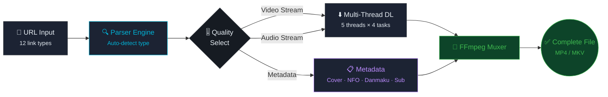
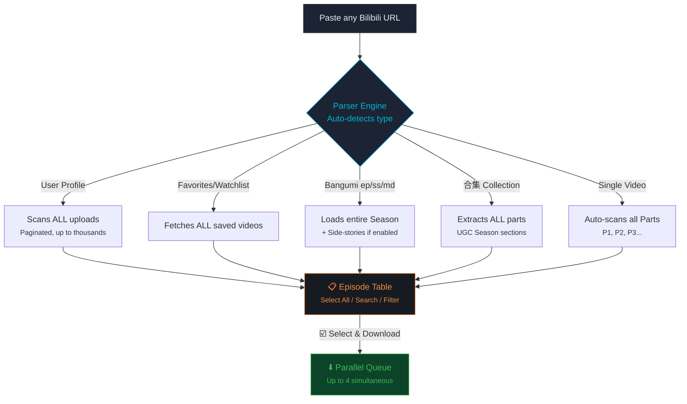
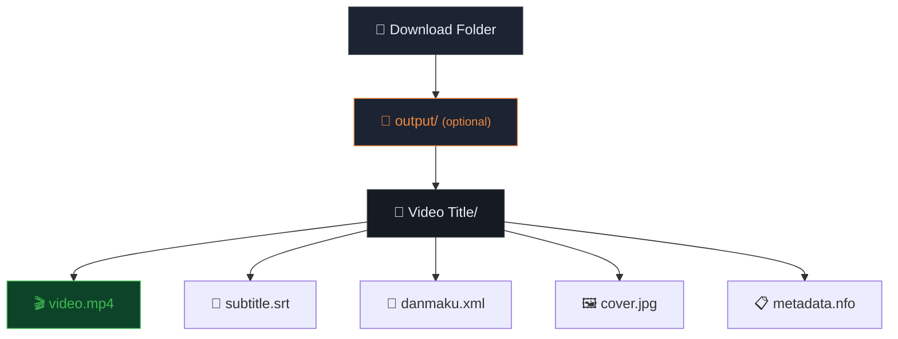

<h1 align="center">📺 LD BILIBILI DOWNLOADER</h1>

  <strong>Comprehensive Desktop Solution for Batch Bilibili Download & Metadata Archival</strong>  
  
  
  
  
  

---

  ⏳ <b>Trial Build</b> — All features unlocked · Expires <b>August 1, 2026</b>

---

## 📥 Download & Install

### Installation & Update Guide:
1. Click the link above to navigate to the Release page.
2. Under the **Assets** section, download the installer `.exe` file (e.g., `LD-bilibili-downloader-1.0.0-Setup.exe`).
3. Run the downloaded `.exe` file to install the application.
4. **How to Update:** When a new version is released, simply download the latest `.exe` installer from the link above and run it. It will automatically overwrite and update your current version without losing any data.

---

> [!WARNING]
> **Trial Version Notice:** This is a trial build. After **August 1, 2026**, the application will expire. Contact the developer for a full license.

---

## 👑 The "Peak" Experience (Killer Features)

- 🕵️ **Zero Account Required:** Download high-quality videos without ever needing to log in. The app bypasses normal web restrictions instantly.
- 🎬 **Download While Watching:** With the built-in browser, just watch Bilibili normally. Found something you like? Click **"Download This Video"** directly on the player page—no copy-pasting URLs required!
- 🎨 **Sleek, User-Friendly Interface:** A highly polished, modern UI (Dark/Light/System themes) designed for seamless daily use. No messy command lines, just an intuitive, beautiful graphical interface.
- ⚡ **Peak Power (Industrial Batching):** Not just a simple downloader. It is a powerhouse that can bulk-download entire Channels, Bangumi seasons, and Playlists using a high-speed, multi-threaded engine.
- 📝 **100% Accurate Subtitles (Creator's Dream):** Instantly extract official Bilibili closed captions and download them as standard `.srt` files. Perfect for creators, allowing you to generate translations and voiceovers (thuyết minh) quickly with 100% accuracy, bypassing the need for manual transcription.

---

## 📊 At a Glance

| Spec | Value |
|:---|:---|
| **Max Resolution** | 1080p+ (HDR with login) |
| **Languages** | 13 (Vietnamese, English, 中文, 日本語, 한국어…) |
| **Output Formats** | MP4, MKV, M4A, MP3, XML, ASS, JSON, SRT, NFO |
| **Threads × Parallel** | 5 threads × 4 simultaneous tasks |
| **Batch Sources** | 12 parser types (User, Favorites, Bangumi, Watch Later, History…) |
| **Trial Expiry** | ⏳ August 1, 2026 |

---

## 🏗️ Processing Pipeline

---

## 🚀 Batch Download — Core Strength

> [!IMPORTANT]
> **This is the most powerful feature of LD Bilibili Downloader.** Unlike basic downloaders that only handle one link at a time, this app can parse an entire User Profile, Favorites playlist, Bangumi season, or Watch Later list — extracting every video automatically — then queue them all for batch download with a single click.

### How Batch Download Works

### Supported Batch Sources (12 Parser Types)

| Source | URL Pattern | Batch | What it Parses |
|:---|:---|:---:|:---|
| **Single Video** | `av` / `BV` code | ✅ | All Parts (P1, P2…) + 合集 UGC Seasons |
| **Bangumi / Drama** | `/ep/` `/ss/` `/md/` | ✅ | Entire season + side-stories (配信/外传) |
| **User Profile** | `space.bilibili.com/uid` | ✅ | **ALL uploads** — auto-paginated |
| **Favorites** | `fid=` / `ml` | ✅ | **ALL saved videos** in the playlist |
| **Watch Later** | `watchlater` / `toview` | ✅ | Full "Watch Later" queue |
| **History** | `history` | ✅ | Recent watch history |
| **Dynamic Feed** | `t.bilibili.com` / `dynamic` | ✅ | Video posts from your feed |
| **Popular / Hot** | `popular` | ✅ | Current trending videos |
| **Cheese (Course)** | `cheese/ep` | ✅ | All episodes in a paid course |
| **Search Results** | `search?keyword=` | ✅ | First page of search results |
| **Short Link** | `b23.tv/xxxx` | ✅ | Auto-resolves to real URL |
| **Live** | `live.bilibili.com` | ⛔ | Detection only (live not downloadable) |

> [!TIP]
> **Batch Selection Tools:** After parsing, use **Select All** (checkbox), **Ctrl+F Search** to find specific episodes, or the **Batch Select** menu to cherry-pick exactly what you want. Then hit "Download Selected" — all chosen items are queued simultaneously.

### 📖 Step-by-Step: How to Batch Download

1. **Find Content:** Use the **Browser Tab** to find a Bilibili User Profile, a Favorite Playlist, or a Bangumi Series.
2. **Trigger Parser:** Click the **"Download This Video"** button (or copy the URL to let the Clipboard Monitor catch it).
3. **Review the List:** The **Parser Tab** will open automatically, displaying a table with all detected episodes (e.g., all 50 videos in a playlist).
4. **Filter & Select:** Check the **Select All** box. (Optional: Turn on "Skip VIP" or "Skip Trailer" in settings to auto-filter the list).
5. **Download:** Select your preferred resolution and click **Download Selected**. Jump to the **Downloads Tab** to watch your parallel tasks fly!

---

## 🌟 Other Core Features

### 🌐 Built-in Browser
- Browse `bilibili.com` directly inside the app (Back, Forward, Reload, Home, Mute).
- One-click **"Download This Video"** — no copy-paste.
- Automatic **clipboard monitoring**: copy a URL anywhere → parser triggers instantly.

### ⏭️ Smart Filtering (Auto-Skip)
| Filter | What it does |
|:---|:---|
| **Skip VIP (会员)** | Auto-uncheck paid/locked episodes |
| **Skip Trailer (预告/PV)** | Remove trailers from the list |
| **Hide Side-stories** | Hide 外传/OST/Bonus sections |

---

## ⬇️ Output Format Matrix

| Content Type | Formats | Details |
|:---|:---|:---|
| **Video** | `MP4` · `MKV` | Up to **1080p+**. Codec priority HEVC/AVC. |
| **Audio** | `M4A` · `MP3` | Auto-convert M4A → MP3 option. |
| **Danmaku** | `XML` · `ASS` · `JSON` | Custom ASS style editor. |
| **Subtitles** | `SRT` · `LRC` · `TXT` · `ASS` · `JSON` | Language suffix support (`.vi`, `.auto`). |
| **Cover Art** | `JPG` · `PNG` | Embed cover into video metadata. |
| **Metadata** | `NFO` | Kodi / Plex / Jellyfin compatible. |

---

## ⚡ Performance & File Management

| Setting | Range | Default |
|:---|:---|:---|
| Threads per task | 1 – 5 | 4 |
| Parallel tasks | 1 – 4 | 1 |
| Speed limiter | Configurable | Unlimited |
| Disk pre-allocation | On / Off | Off |

### 📁 Storage Organization

- **Per-video folders** — Group video + subtitle + cover + NFO.
- **Separate meta-folder** — Video at root, metadata in `output/`.
- **Conflict resolution** — Auto-rename or overwrite.

---

## 🎨 User Experience

| Feature | Details |
|:---|:---|
| 🎨 **Theme** | Dark · Light · System Auto |
| 🌐 **Languages** | 13 languages (Vietnamese, English, 中文, 日本語…) |
| 📌 **Always-on-Top** | Pin window above all apps |
| 🚪 **Close Behavior** | Exit / Minimize to tray / Ask |
| 🔔 **Notifications** | Alert when download completes |
| 🕒 **Parse History** | Re-download from past links |
| 🔎 **Search (Ctrl+F)** | Find episodes in large lists |
| ☑️ **Batch Selection** | Select/deselect in bulk |

---

  <strong>LD Bilibili Downloader v1.0.0</strong> · Trial Build · Expires: August 1, 2026 
  <em>12 parser types · Batch download entire channels · Designed for power.</em>

