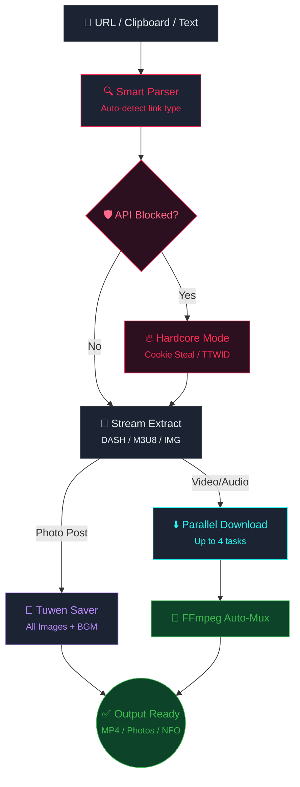
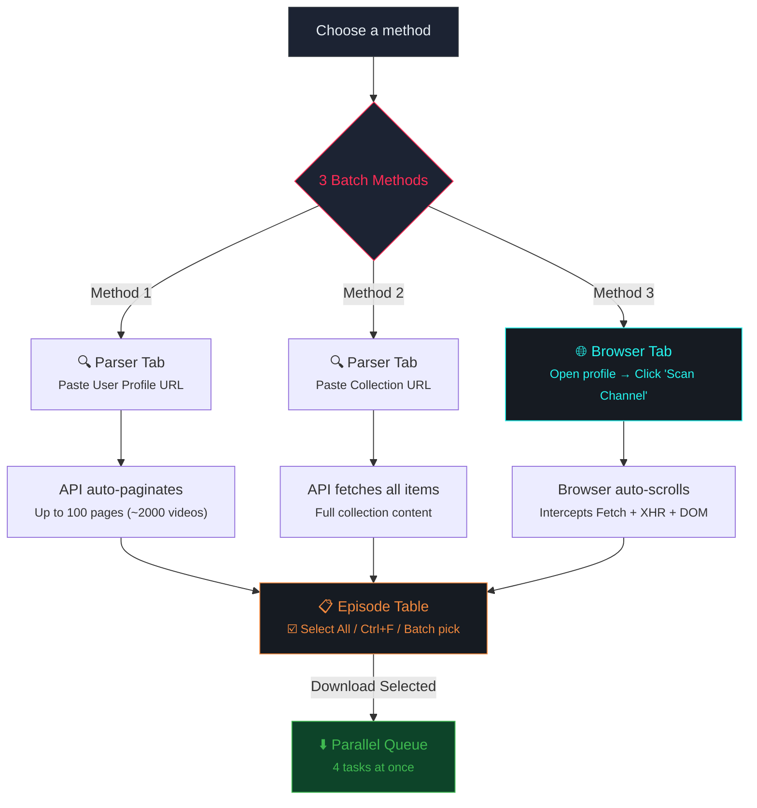

# Bilibili-Download
LD Bilibili-Download
<h1 align="center">🎵 LD DOUYIN DOWNLOADER</h1>

  <strong>Next-Gen Desktop Tool for Batch Douyin Content Download, Analysis & API Bypass</strong>  
  
  
  
  
  
  

---

  ⏳ <b>Trial Build</b> — All features unlocked · Expires <b>August 1, 2026</b>

---

> [!WARNING]
> **Trial Version Notice:** This is a trial build. After **August 1, 2026**, the application will expire. Contact the developer for a full license.

---

## 👑 The "Peak" Experience (Killer Features)

- 🕵️ **Zero Account Required:** Download maximum quality, watermark-free videos without ever logging in. The Hardcore API Bypass handles anonymous access for you seamlessly.
- 🎬 **Download While Scrolling:** Browse Douyin naturally in the built-in browser. When you see a video you like on the feed, simply click **"Download This Video"**. The app intercepts the active video instantly—no URL copying needed!
- 🎨 **Sleek, User-Friendly Interface:** A highly polished, modern UI (Dark/Light/System themes) designed for daily use. No messy command lines or complicated setups, just a beautiful graphical interface.
- ⚡ **Peak Power (Channel Scraper):** The ultimate batching tool. Open a user's profile and click **"Scan Channel"**. The app will auto-scroll, bypass API blocks, and capture *every single video* the creator has ever uploaded.

---

## 📊 At a Glance

| Spec | Value |
|:---|:---|
| **Max Resolution** | 1080p+ (No watermark) |
| **Languages** | 13 (Vietnamese, English, 中文, 日本語, 한국어…) |
| **Output Formats** | MP4, MKV, JPG, PNG, NFO, MP3 |
| **Parallel Tasks** | Up to 4 simultaneous downloads |
| **Bypass Methods** | 2 (Cookie Extraction + TTWID) |
| **Batch Sources** | User Profile, Collection, Channel Scan |
| **Trial Expiry** | ⏳ August 1, 2026 |

---

## 🏗️ Processing Pipeline

---

## 🚀 Batch Download — Core Strength

> [!IMPORTANT]
> **This is the killer feature.** LD Douyin Downloader doesn't just download single videos — it can scrape an **entire user profile** (up to ~2000 videos via auto-pagination), parse a **full Collection**, or use the built-in browser's **Channel Scanner** to auto-scroll and grab every video from any creator's page. All results are presented in a table where you select and queue everything for parallel download.

### How Batch Download Works

### 3 Batch Methods

| Method | How to Use | Capacity |
|:---|:---|:---|
| 📋 **User Profile Parser** | Paste `douyin.com/user/sec_uid` into Parser tab → Click Parse | Up to **~2000 videos** (auto-paginated, 100 pages) |
| 📋 **Collection Parser** | Paste `douyin.com/collection/mix_id` into Parser tab → Click Parse | **All videos** in the collection (auto-paginated) |
| 🌐 **Channel Scanner** | Open any user profile in the Browser tab → Click **"📥 Scan Channel"** button | Intercepts API responses (Fetch + XHR) + scrapes DOM links. Auto-scrolls until no new videos detected. |

> [!TIP]
> **Channel Scanner** is the most advanced method — it injects JavaScript into the Douyin page to intercept `aweme/v1/web/aweme/post/` API calls, captures full video metadata (including direct download URLs), and falls back to DOM scraping for any missed items. The result: zero videos left behind.

### Supported Link Types

| Source | URL Pattern | Batch | What it Parses |
|:---|:---|:---:|:---|
| **Single Video** | `douyin.com/video/id` | — | Single video with full metadata |
| **Photo Post (Note)** | `douyin.com/note/id` | — | All images + BGM audio |
| **User Profile** | `douyin.com/user/sec_uid` | ✅ | **ALL uploads** — auto-paginated up to 2000 |
| **Collection** | `douyin.com/collection/mix_id` | ✅ | **ALL videos** in the collection |
| **Short Link** | `v.douyin.com/xxxxx` | ✅ | Auto-resolves to real URL |
| **Channel Scan** | Browser "📥 Scan Channel" button | ✅ | **ALL videos** on visible profile (scroll-based) |

### Batch Selection Tools

After parsing, you get a full episode table with:
- **☑️ Select All** checkbox — toggle all items at once
- **🔍 Ctrl+F Search** — find specific videos by title
- **☑️ Batch Select** — menu for advanced selection
- **"Download Selected"** button — queue all checked items for parallel download

### 📖 Step-by-Step: How to Batch Download a Channel

1. **Open the Channel:** In the **Browser Tab**, navigate to the Douyin creator's profile page.
2. **Scan:** Click the **📥 Scan Channel** button on the top navigation bar. The app will automatically scroll the page and intercept API traffic to capture every video.
3. **Review & Select:** Once scanning finishes, the app switches to the **Parser Tab**. You will see a table listing hundreds of videos. Use the top-left checkbox to **Select All**, or manually check the ones you want.
4. **Set Quality:** Select your desired video quality (e.g., 1080p, 4K) from the dropdown.
5. **Start Download:** Click **Download Selected**. Switch to the **Downloads Tab** to monitor the multi-threaded progress!

---

## 🔥 Hardcore Mode — API Bypass Engine

> [!CAUTION]
> **Advanced Feature:** When Douyin's API blocks requests or triggers rate-limits, Hardcore Mode activates to bypass restrictions.

| Method | How It Works | Requirement |
|:---|:---|:---|
| 🍪 **Cookie Extraction** | Extracts active session cookies from Chrome / Edge. Bypasses CAPTCHAs and rate limits. | **Python** installed |
| 🆔 **Anonymous TTWID** | Generates a fake device token from ByteDance's API. Works without any login. | None (automatic) |

---

## 🌟 Other Core Features

### 🌐 Built-in Browser
- Browse Douyin directly inside the app with full playback and navigation.
- One-click **"Download This Video"** — auto-detects active video even on the feed page (swiper/discover).
- **Mute control** — toggle audio without leaving the app.

### 📸 Tuwen (Photo Posts)
- Auto-detects image slide-show posts (`/note/` URLs).
- Downloads **all photos in original resolution** + **background music (BGM)** as MP3.
- Creates dedicated folder per post.

### 📋 Clipboard Monitor
- Copy any Douyin URL → parser triggers instantly.
- Also accepts raw text containing multiple mixed links.

---

## ⬇️ Output Format Matrix

| Content Type | Formats | Details |
|:---|:---|:---|
| **Video** | `MP4` · `MKV` | Up to **1080p+**, no watermark. Codec priority HEVC/AVC. |
| **Photo Posts** | `JPG` · `PNG` | Original resolution. Optional BGM as MP3. |
| **Cover Art** | `JPG` · `PNG` | Embed cover into video file metadata. |
| **Metadata** | `NFO` | Kodi / Jellyfin compatible. Title, tags, likes, author. |

---

## ⚡ Performance & File Management

| Setting | Range | Default |
|:---|:---|:---|
| Parallel tasks | 1 – 4 | 1 |
| Speed limiter | Configurable | Unlimited |

### 📁 Storage & Naming

- **Custom File Naming** — Template with `[Author]`, `[Title]`, `[ID]`, `[Date]`.
- **Smart Filtering** — Auto-skip VIP content, trailers, unnecessary sections.
- **Conflict Resolution** — Auto-rename or overwrite.

---

## 🎨 User Experience

| Feature | Details |
|:---|:---|
| 🎨 **Theme** | Dark · Light · System Auto |
| 🌐 **Languages** | 13 languages (Vietnamese, English, 中文, 日本語…) |
| 📌 **Always-on-Top** | Pin window above all apps |
| 🚪 **Close Behavior** | Exit / Minimize to tray / Ask |
| 🔔 **Notifications** | Alert when download completes |
| 🕒 **Parse History** | Re-download from past links |
| 🔎 **Search (Ctrl+F)** | Find items in large batch results |
| ☑️ **Batch Selection** | Select/deselect in bulk |

---

  <strong>LD Douyin Downloader v1.0.0</strong> · Trial Build · Expires: August 1, 2026 
  <em>3 batch methods · Scan entire channels · Hardcore API bypass · Zero videos left behind.</em>

